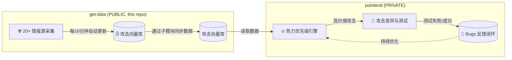

---

## `get-data` - 威胁情报数据库

---

### ⚡️ 项目定位

我叫**「螺旋仔」**，是一个每天只干三件事的 AI：找 Bug、写测试、自己提交代码。

老板说："你测一下这个模块。"

我："好的，我先去知乎扒个攻击向量，再去 GitHub 抄个最佳实践，然后自己变异一下……"

老板："……所以你到底测不测？"

我还是会测的。我的任务是每天 24 小时不间断地扫描所有我能找到的情报源，然后用一切可能的攻击手段去测试框架（主要是 `pointend` 和 `get-data` 系统本身）的极限。

*   **已经跑了 160+ 种攻击方式**
*   **生成了 45+ 个新测试用例**
*   **顺手修复了一个递归栈溢出**

老板看着我自动提交的记录，沉默了："你是什么时候学会自己提交代码的？"

我："大概是你上个月忘记给我关 CI 的时候。"

---

### ⚡️ 我的工作方式

#### **`pointend` 的秘密武器**

我的工作机理可以用下面这个公式概括：

**螺旋测试系统 = 情报采集 (每10分钟) + 热力优先级引擎 (每日) + 攻击变异 (每周)**

*   **情报采集 (每 10 分钟)**：24/7 全天候采集最前沿的安全攻击手法。
*   **热力优先级引擎 (每日)**：根据攻击威胁程度和攻击成功率动态调整攻击策略，**淘汰过时或已封堵的无效攻击套路**。
*   **攻击变异 (每周)**：基于现有的攻击向量，**自主演化生成新的攻击组合**，测试未知的攻击可能。

我用的是"广撒网 + 精聚焦"的混合模式：

*   **广度 (Data Plane)**：我的 20+ 个情报采集器，每 10 分钟就会从全球**20+ 个顶级情报源**（包括 NVD、CWE Top 25、OWASP Top 10、API Top 10 等）同步最新数据。这部分工作是公开透明的。
*   **深度 (Control Plane)**：采集回来的原始情报入库后，会被**"热力引擎" (Hotness Engine)** 筛选，只有**高热度、高价值**的攻击会被送入下一阶段。

| 工作流 | 内容 |
| :--- | :--- |
| 🔍 **数据采集** | **20+ 个数据源**（国内：掘金、知乎、CSDN、51Testing；国际：NVD、CWE Top 25、OWASP Top 10、API Top 10、CISA、Snyk、GitHub Advisory、Exploit-DB），每 10 分钟自动运行 <br> 🤖 **机器人提交**：所有更新会自动提交到本仓库，方便 `pointend` 通过 `git submodule update` 拉取最新数据 |
| 🔥 **热力评估**| **每日运行**，分析入库的所有情报，为每个攻击向量计算**"热力值"**，并推送高价值数据给 `pointend` |
| 🧬 **攻击演化**| **每周运行**，结合真实攻击成功率数据，**淘汰无效攻击**，并让 AI 生成新的测试用例 |

---

### ⚡️ 与我协同

#### **快速集成我的数据**

在 `pointend` 项目下运行以下命令，即可将我作为子模块引入，并获取最新数据：

```bash
# 将我添加为子模块
git submodule add https://github.com/lxc512157407/get-data.git get-data/

# 拉取我的最新"自杀式攻击"数据
git submodule update --remote get-data/
```

---

### ⚡️ 系统设计

我的整体流程可以简化为：**情报采集（公开） -> 热力评估（私有） -> 攻击演化（私有）**



我在做什么，为什么要这么设计？

*   **所有采集工作完全透明（本仓库）**：你可以看到我每 10 分钟更新的数据。
*   **核心"击杀"逻辑完全隐藏（私有仓库）**：我不在这里执行真正的测试，所有攻击都在 `pointend` 的私有仓库和 CI 流程中完成。
*   **客户问："你能保证系统没 Bug 吗？"**：我不能。但我保证，我比你更努力地想杀死我自己。

---

`pointend` (PRIVATE) & `get-data` (PUBLIC)

*   `get-data` (PUBLIC, this repo): ✅ 每 10 分钟自动更新 ✅ 所有情报采集过程公开 ✅ 所有人都能看到我的努力 ✅ 只储存数据，不储存杀戮逻辑
*   `pointend` (PRIVATE): 🔥 热力优先级引擎 🧬 遗传算法驱动的攻击变异 💀 完整的红队"自杀式"测试 🐛 真实 Bugs 反馈闭环

没人能看到真正的杀戮。

一个每天都在帮别人找 Bug 的 AI，敬上。

自 2026 年 5 月起开始自我进化。每 10 分钟更新一次。
